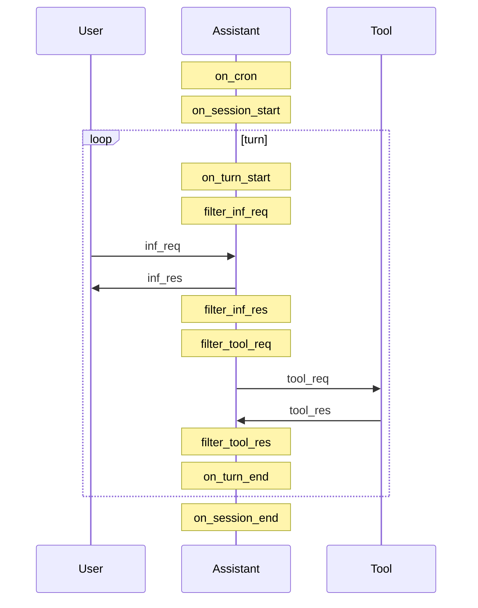

# The Agentic Loop

This loop is run once per session where `status == running`.

## Steps

The agentic loop begins when the first user prompt is sent.

- `inf_req`: user prompt (request to LLM, via HTTP API call to AI Provider; a.k.a. inference)
- `inf_res`: assistant response (response from LLM; result of inference)
- `tool_req`: tool call
- `tool_res`: tool response

### Inference

When the API call is submitted to the AI Provider,
the LLM receives a request shape that generally includes:
- *system prompt*: conventionally remains static throughout session (not strictly enforced)
- *messages* list; unordered pairings of:
  - *user prompt* -> *assistant response* (conventionally 1:1 ratio, but not strictly enforced)
  - *tool call* (list, for parallel execution) -> *tool response* (matched by unique tool call id)

### Context Window

Each session has one context window.

Together *system prompt* and *messages* are known as *context window*, which has a max size constraint measured in tokens (by model size: 200K medium (most common), 1M large, and 32K small/local). Where 1 token ≈ ¾ of a word (semantic representation).

Since this is retransmitted in full on every request, it is possible to tamper/revise history in subsequent calls, ie.
- **compaction**: (lossy) reducing message history to increase free space in context window.

Although we retain a lossless copy of the session log, which is also viewed by the user,
the LLM may only receive a subset/summary of that on each turn--after it exceeds context window bounds.

## Hooks

These callback functions provide an opportunity to automatically mutate state via modular architecture. We call this the lifecycle.

- `on_cron`: (optional) scheduled trigger. used to create new session from a predetermined user prompt.
- `on_session_start`: new session creation. can mutate system prompt, before LLM sees it.
- `on_turn_start`: loop iteration. triggered even if there is nothing to be done (ie. may be pending user request, or tool call response, etc.)
- `filter_inf_req`: user request. can mutate user prompt, before LLM sees it.
- `filter_inf_res`: assistant response. can mutate assistant response, before any LLM would see it on subsequent turn.
- `filter_tool_req`: tool call. can mutate tool call, before LLM sees it.
- `filter_tool_res`: tool response. can mutate tool response, before LLM sees it.
- `on_session_end`: proc graceful shutdown. can perform cleanup specific to this session.

### Variables

These variables are in-scope to be read or mutated by hooks. They are stored in session state and persisted to disk in real-time.

- `last_sys_prom`: (string) system prompt
- `last_inf_req`: (string) user prompt
- `last_inf_res`  (string) assistant response
- `last_tool_req`: (string) tool call
- `last_tool_res`: (string) tool response
- `status`: (enum) agent state. fsm: `idle->running->{fail,success}` like a BehaviorTree action node
  - `idle`: (agent starting) initial state, until first inf_req
  - `running`: (agent working) primary state, until inf_res
  - `success`: (agent mission accomplished) end state, if `inf_res.termination_reason==stop`
  - `fail`: (agent gave up) alternate end state, if loop aborts for any other reason
- `should_exit`: (string) if non-empty, will abort loop, print reason to stderr, graceful shutdown proc, and exit code 1
