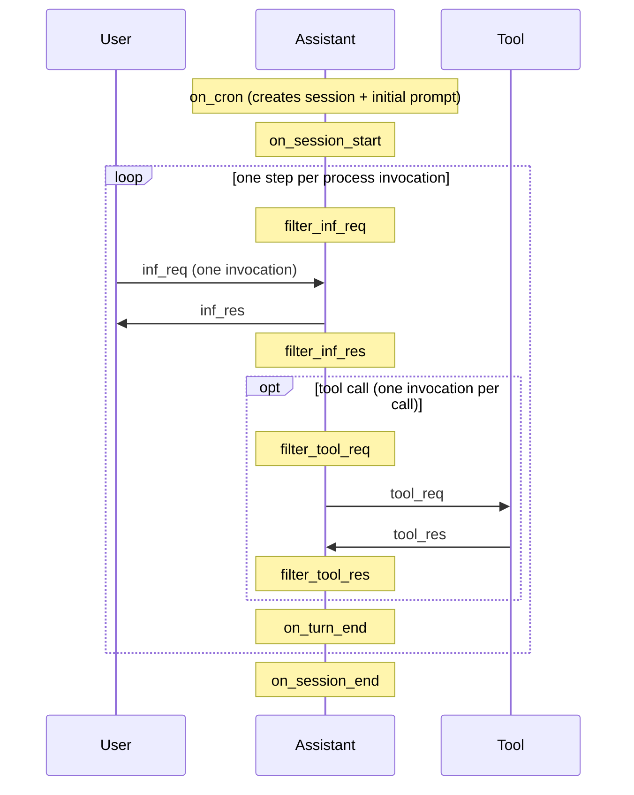

# The Agentic Loop

The loop is driven externally — one step per `wasm1` process invocation. A step is the smallest unit of progress: one LLM inference, or one tool call execution. The session YAML file on disk is the authoritative state store. Every invocation reads from it, executes one step, writes back to it, and exits.

## Steps

The agentic loop begins when the first user prompt is received.

- `inf_req`: user prompt (request to LLM, via HTTP API call to AI Provider; a.k.a. inference)
- `inf_res`: assistant response (response from LLM; result of inference)
- `tool_req`: tool call request
- `tool_res`: tool response

### Inference

When the API call is submitted to the AI Provider,
the LLM receives a request shape that generally includes:
- *system prompt*: conventionally remains static throughout session (not strictly enforced)
- *messages* list; unordered pairings of:
  - *user prompt* -> *assistant response* (conventionally 1:1 ratio, but not strictly enforced)
  - *tool call* (list, for parallel execution) -> *tool response* (matched by unique tool call id)

In a collaborative session, context assembly filters messages by `meta.subscribers` (which agent
can see each item) and `meta.visible` (operator gate). See [TEMPLATE.md](TEMPLATE.md) for schema details.

### Context Window

Each session has one context window.

Together *system prompt* and *messages* are known as *context window*, which has a max size constraint measured in tokens (by model size: 200K medium (most common), 1M large, and 32K small/local). Where 1 token ≈ ¾ of a word (semantic representation).

Since this is retransmitted in full on every request, it is possible to tamper/revise history in subsequent calls, ie.
- **compaction**: (lossy) reducing message history to increase free space in context window.

Although we retain a lossless copy of the session log, which is also viewed by the user,
the LLM may only receive a subset/summary of that on each turn--after it exceeds context window bounds.

## Hooks

These callback functions provide an opportunity to automatically mutate state via modular architecture. We call this the lifecycle. See [HOOKS.md](HOOKS.md) for hook shapes, job/step model, and event payload reference.

Session/template YAML schema details are documented in [TEMPLATE.md](TEMPLATE.md).

- `on_cron`: (optional) scheduled trigger. used to create a new session from a predetermined user prompt.
- `on_session_start`: new session creation. can mutate system prompt, before LLM sees it.
- `filter_inf_req`: user request. can mutate user prompt before LLM sees it. Output from hook `llm` steps is appended to the prompt.
- `filter_inf_res`: assistant response. can mutate assistant response before any subsequent inference.
- `filter_tool_req`: tool call. blocking — can prevent tool execution.
- `filter_tool_res`: tool response. can observe or mutate tool result before LLM sees it.
- `on_turn_end`: fires after each completed step (inference or tool result). non-blocking side-effect hook.
- `on_session_end`: session teardown. can perform cleanup specific to this session.

### Variables

These variables are in scope to be read by hooks via expression templates (`${{ ... }}`). They are populated from session state per-turn.

- `last_inf_req`: (string) user prompt sent to the LLM this turn
- `last_inf_res`: (string) assistant response received from the LLM this turn
- `last_tool_req`: (string) tool call (name + args)
- `last_tool_res`: (string) tool response
- `session_primary_system_prompt`: (string) system prompt of the root/primary agent in the session
- `status`: (enum) agent state. `IDLE` → `SUCCESS` or `FAIL`
- `should_exit`: (string) if non-empty, will abort loop with reason
